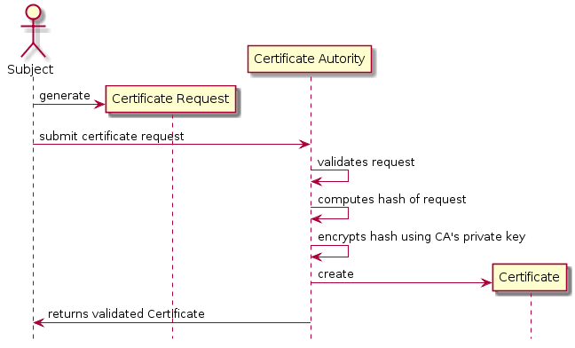

# Week 7 - Certificates under the hood

This week there will be class both Tuesday and Thursday.

The main coding we will be doing is the build a simple https server.

### Readings:
* [This page from Verisign](https://www.verisign.com/en_US/website-presence/website-optimization/ssl-certificates/index.xhtml) gives a good general intro (non-tech) to what certificates are.

* Many of the algorithms we have seen in the Java libraries use the Factory design pattern. [The wikipedia entry "Abstract factory" is the least wrong I found](https://en.wikipedia.org/wiki/Abstract_factory_pattern)

* What is a certificate in the first place? Wikipedia has two articles we will study in class
	* What is a [Public key certificate](https://en.wikipedia.org/wiki/Public_key_certificate)
	* What is the [X.509 standard](https://en.wikipedia.org/wiki/X.509)

The plan for the two days is that we Tuesday get a simple https server up and running using a selfsigned certicicate. The code for this is in this project.

And the exercise for Thursday is to get the same server running with a real certificate.

## Tuesdays plan
ssh tunnel: 
	`ssh -D 9999 -C <userinfo>` 
	
### Certificates in HTTPS
Overall activity diagrams ([stolen from this source](https://www.researchgate.net/publication/261464984_Socio-technical_formal_analysis_of_TLS_certificate_validation_in_modern_browsers))

1. [Activity diagram for certificate validation in Internet Explorer](https://www.researchgate.net/profile/Rosario_Giustolisi/publication/261464984/figure/fig2/AS:296824180101120@1447779807297/Activity-diagram-for-certificate-validation-in-Internet-Explorer.png)
2. [Activity diagram for certificate validation in Chrome](https://www.researchgate.net/profile/Rosario_Giustolisi/publication/261464984/figure/fig1/AS:296824175906819@1447779807145/Activity-diagram-for-certificate-validation-in-Chrome.png)
3. [Activity diagram for certificate validation in Firefox](https://www.researchgate.net/profile/Rosario_Giustolisi/publication/261464984/figure/fig3/AS:296824180101121@1447779807405/Activity-diagram-for-certificate-validation-in-Firefox.png)

### A SimpleHTTPS Server
1. Clone this project
2. Generate a self-signed certificate as described on https://stackoverflow.com/questions/2308479/simple-java-https-server (krishnakumar sekar's answer)
3. You can start it from netbeans, and connect to it from a browser (try several different browsers)

### Hierarchy of certificates
There are a [hierarchy of certificates](https://upload.wikimedia.org/wikipedia/commons/d/d1/Chain_of_trust.svg) ([taken from wikipedia](https://en.wikipedia.org/wiki/Public_key_certificate)). In addition to those in the figure, there is the one we have made which is a **self signed certificate**.

#### Exercises continued

4. Build the project, copy the jar file and the keystore file to a droplet and run the jar file in in a droplet
5. Connect to it using at least two different browers
6. Does your browser trust it next time around?

## Preperation for thursday
* Get a named droplet (or other linux machine), that is, a droplet you can connect to by a DNS name instead of an IP address. This is a two phase operation
	1.  Get a domain name. I got one from "GoDaddy", but there are many *registrars* available. I was able to set it up using [the "godaddy" secion in this blog](https://www.digitalocean.com/community/tutorials/how-to-point-to-digitalocean-nameservers-from-common-domain-registrars)
	2. Next you need to set it up on your droplet. Here I was able to get it done using [this blog from digital ocean](https://www.digitalocean.com/community/tutorials/how-to-set-up-a-host-name-with-digitalocean).

## Thursday plan
* Get the SimpleHTTPSServer to run without complaints with a "real certificate" (end-entity certificate)
* Recap the security of a certificate by going over the X.509 format and understanding which signatures, keys and hashes which are involved.

### Setting it up with an authenticated certificate
There are two steps in this:

1. Getting an authenticated certificate
2. Converting the certificate to "java keystore" format.

##### 1. Getting an authenticated certificate
To get a certificate for your site, you can [follow this guide](https://www.digitalocean.com/community/tutorials/how-to-use-certbot-standalone-mode-to-retrieve-let-s-encrypt-ssl-certificates). The guide suggest you are logged in as a sudo user. That is a good idea from a professional point of view. From a "I am a student trying to learn" perspective it is easier to do as root. You need to do step 1 to 3 (step 4 is about *renewing* your certificate).

After the process you should have some files (quite a lot actually) in `/etc/letsencrypt/`. In particular there are two files in the `archive/yoursitename` folder which you need for the next step `fullchain1.pem` and `privkey1.pem`.
 

##### 2. Converting a certificate in pem format to jks format

In an ideal world there would be only one standard fileformat for certificates, but no such luck. The certificates we got above are in `pem` format, and we need `jks`. When searching for this on google it is clear we are not the first to face this issue. Ubunto comes with the commands we need:

`openssl pkcs12 -export -inkey private.pem -in full.pem -name test -out test.p12`

Then export p12 into jks

`keytool -importkeystore -srckeystore test.p12 -srcstoretype pkcs12 -destkeystore test.jks`

(stolen from [this stackexchange](https://serverfault.com/questions/483465/import-of-pem-certificate-chain-and-key-to-java-keystore))

Finally, you need to make the SimpleHTTPSServer read this new `jks` file instead of the old one.

When all is done, you should be able to `https:yoursite:5678/test` and it should respond with:

```
This is the response, noone tampered with it
```

### What makes a certificate secure?
The idea of a certificate is that a certificate autority vouches for the subject of the certificate being who he/she/it claims to be. But just how can we see that inside a certificate?

The following [figure](https://en.wikipedia.org/wiki/Public_key_certificate#/media/File:PublicKeyCertificateDiagram_It.svg) from [wikipedia](https://en.wikipedia.org/wiki/Public_key_certificate) explain it somewhat.
)

When I read it, it was a bit unclear what the "Digital Signature
of the Certificate Authority" (red block) actually represents. 

With the help of the [this answer](https://security.stackexchange.com/questions/71199/what-is-the-difference-between-a-thumbprint-algorithm-signature-algorithm-an) I believe the idea is as depicted in this diagram:



#### Examining a certificate

To examine the contents of a pem certificate, we can use the ubunto command `openssl`.

`openssl x509 -in fullchain1.pem -text -noout` gives this output for my certificate:

```
root@siteofnoreturn:~# openssl x509 -in fullchain1.pem -text -noout
Certificate:
    Data:
        Version: 3 (0x2)
        Serial Number:
            04:60:d4:53:06:4c:d5:c9:70:15:60:b6:0f:51:e2:80:05:0c
    Signature Algorithm: sha256WithRSAEncryption
        Issuer: C=US, O=Let's Encrypt, CN=Let's Encrypt Authority X3
        Validity
            Not Before: Mar 10 14:44:59 2018 GMT
            Not After : Jun  8 14:44:59 2018 GMT
        Subject: CN=siteofnoreturn.com
        Subject Public Key Info:
            Public Key Algorithm: rsaEncryption
                Public-Key: (2048 bit)
                Modulus:
                    00:b1:95:4e:38:84:2a:3d:1e:6c:6a:26:f6:8a:ad:
                    2e:70:d4:bf:4a:95:46:03:6c:2e:e3:08:7d:61:42:
                    de:a5:cb:a0:c3:cb:f1:a9:1e:ef:1b:bd:63:8c:e6:
                    42:08:fd:2f:ed:69:58:5d:dd:ab:80:6e:71:47:1d:
                    b4:69:ad:1e:cf:fb:94:31:9a:6b:b5:8a:c3:40:d5:
                    1c:82:3d:7d:96:85:b2:b1:d0:44:5c:bd:32:42:ef:
                    dd:8c:4c:df:bb:5d:3c:31:e7:a5:5e:19:63:97:c8:
                    3f:14:a5:da:84:73:ff:63:9b:22:82:52:bd:0d:64:
                    d9:68:8c:ad:93:e3:ba:c9:71:ec:d2:4c:81:56:89:
                    26:12:c0:ac:58:7f:d6:2e:1c:a0:cb:5d:d8:41:72:
                    60:5e:6e:1f:32:a0:d0:21:a2:58:f7:1f:80:ee:14:
                    b3:ae:d7:50:e8:ed:c7:a1:07:b2:84:54:bc:be:66:
                    da:49:2d:f6:29:63:c5:97:41:71:37:d9:77:f8:cc:
                    50:72:ae:91:ed:4e:5c:3a:10:9d:5e:8d:b5:9b:56:
                    ce:5e:bc:6f:f8:0b:98:79:d5:90:15:83:98:be:36:
                    46:51:6d:2b:f6:36:2b:3e:b2:1e:65:fb:08:2a:47:
                    75:2d:c3:5c:cc:26:e7:c7:e2:f9:78:2e:29:ad:71:
                    9a:8b
                Exponent: 65537 (0x10001)
        X509v3 extensions:
            X509v3 Key Usage: critical
                Digital Signature, Key Encipherment
            X509v3 Extended Key Usage: 
                TLS Web Server Authentication, TLS Web Client Authentication
            X509v3 Basic Constraints: critical
                CA:FALSE
            X509v3 Subject Key Identifier: 
                33:D6:44:87:25:1B:2D:44:10:7F:67:17:54:EC:15:E7:BD:36:64:07
            X509v3 Authority Key Identifier: 
                keyid:A8:4A:6A:63:04:7D:DD:BA:E6:D1:39:B7:A6:45:65:EF:F3:A8:EC:A1

            Authority Information Access: 
                OCSP - URI:http://ocsp.int-x3.letsencrypt.org
                CA Issuers - URI:http://cert.int-x3.letsencrypt.org/

            X509v3 Subject Alternative Name: 
                DNS:siteofnoreturn.com
            X509v3 Certificate Policies: 
                Policy: 2.23.140.1.2.1
                Policy: 1.3.6.1.4.1.44947.1.1.1
                  CPS: http://cps.letsencrypt.org
                  User Notice:
                    Explicit Text: This Certificate may only be relied upon by Relying Parties and only in accordance with the Certificate Policy found at https://letsencrypt.org/repository/

    Signature Algorithm: sha256WithRSAEncryption
         84:18:19:ea:af:67:99:da:c6:d2:d0:5e:c0:67:17:80:15:a3:
         e9:06:fe:bd:83:e1:3c:31:8d:8f:7e:db:ff:2b:b1:5f:83:82:
         68:83:2d:44:eb:9f:70:f9:dd:07:17:6e:ff:7b:72:ca:81:43:
         bc:64:8e:ad:30:3d:cb:2a:46:be:7a:68:21:52:cf:cb:c1:7f:
         b2:9c:b4:a3:15:11:f3:94:8b:fd:e9:7c:09:1d:4c:08:57:a2:
         dd:7f:a0:dc:ce:f4:64:76:50:75:46:36:77:ba:5f:54:38:8d:
         8e:4b:65:a6:bc:f3:7d:90:7c:52:ce:16:fa:30:4f:36:31:7c:
         28:08:9f:27:2d:ab:d7:89:d0:08:2f:e7:60:4a:3b:aa:a1:e9:
         fe:e3:94:f6:7b:d7:da:55:a4:93:02:35:4d:00:b4:16:5e:94:
         2d:24:f4:73:1c:ec:22:1b:ee:34:0b:80:54:21:f1:53:00:9c:
         fc:a2:95:13:d1:a5:ef:2a:34:30:b0:18:48:02:78:da:5b:62:
         d8:d8:67:e9:ab:37:84:f9:57:50:01:3e:99:b2:ac:74:3d:21:
         1a:4f:f8:bb:60:1e:6f:da:15:85:57:d4:6e:5a:84:c8:ce:58:
         34:62:d2:9e:c4:27:45:21:c0:68:29:d7:f4:df:56:f1:78:72:
         16:54:9f:2a
root@siteofnoreturn:~# 
```


